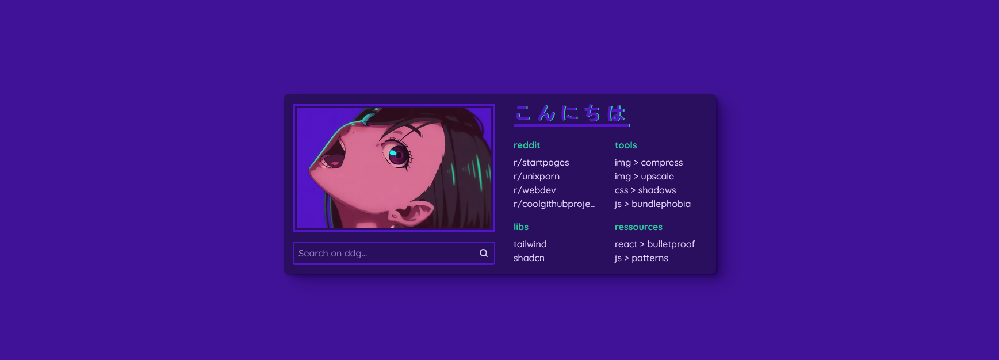

# DanDaDan Startpage

A simple startpage, iterating over multiple images from the DanDaDan opening.

## How to use

To use it yourself, fork the repo and set it up to automatically deploy the startpage:
1. In your repo, open the `Settings` and in there the `Pages` page
2. Click on the `Source` select and choose `Github Actions`
3. Switch to the `Actions` tab, click on `Deploy to Pages` and then `Run workflow`
4. When reloading the page, a deployment job should be pending now.
   After completion, your page is deployed on `https://<your-user-name>.github.io/dandadan-startpage/`
5. See [Customizability](#customizability) on how to adjust the content

Then you need to set it up in your browser.
The easiest is to pick a `New tab override` browser extension in your browsers extension store and insert your page url.

## Customizability

Content can be adjusted in `src/scripts/index.js`:
- Adjust bookmarks by updating the `bookmarks` variable
- You can "pin" an image variant by passing its name in the `updateVariant` function
  - e.g.: `updateVariant("momo-1")`
  - All variant names can be found in `src/scripts/variants.js`
